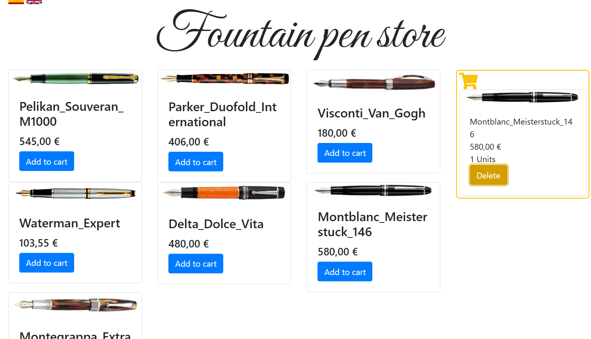

# Sesiones-y-cookies-
Este pequeño programa es una pequeña web echa con jsp y java sobre la adición y eliminación de estilográficos al un carrito

## Vista del catalogo en **Español**  
  

## Vista del catalogo en **Ingles**  
)  

## Vista del catalago con objetos dentro del carrito  
)  

## Vista del catalago con un objeto menos en el carrito  
)
